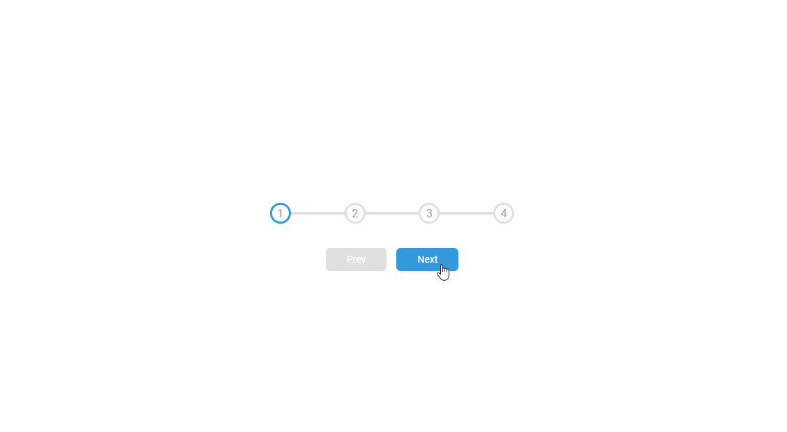

# Progress Steps

## 🦉 Main information

Progress bar that starts at one and goes along four.

The project goal:
- buttons to control the steps
- line transition between steps
- not active button must be disabled
- set up in HTML, style it with CSS and add the functionality with JavaScript

## ⚡ Built With

[HTML5](https://www.w3schools.com/html/) / [CSS3](https://www.w3schools.com/css/) / [JavaScript](https://www.w3schools.com/js/)